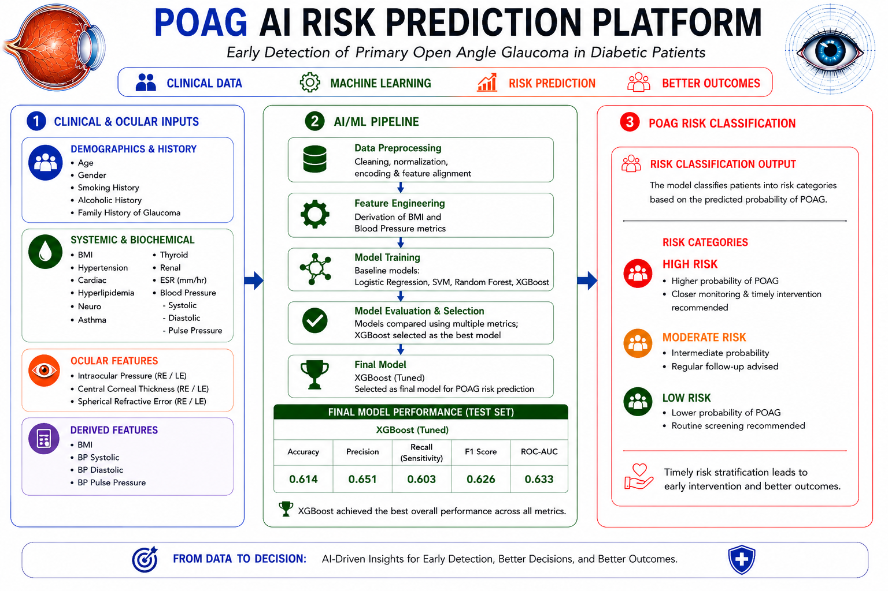

# POAG Diabetic vs Non-Diabetic Phenotype AI Platform

## Overview

This project presents an **AI-driven clinical decision support system** for the stratification of **Primary Open Angle Glaucoma (POAG)** into diabetic and non-diabetic phenotypes.

The platform integrates **clinical, systemic, and ocular features**, applies machine learning, and provides **interpretable predictions using SHAP**, enabling deeper insight into disease heterogeneity.

---

## Objective

* Transform raw clinical inputs into structured features
* Capture both **systemic metabolic** and **ocular risk signals**
* Stratify POAG into **diabetic vs non-diabetic phenotypes**
* Provide **interpretable predictions** for clinical understanding

---

## System Workflow

Raw Clinical Data → Preprocessing → Feature Engineering → XGBoost Model → Phenotype Prediction → SHAP Interpretation

---

## Features Used

### Demographic & Clinical History

* Age, Gender
* Smoking History, Alcoholic History
* Family History of Glaucoma

### Systemic & Metabolic Factors

* BMI
* Hypertension, Cardiac, Hyperlipidemia
* ESR (mm/hr)
* Blood Pressure (Systolic, Diastolic, Pulse Pressure)

### Ocular Parameters

* Intraocular Pressure (RE/LE)
* Central Corneal Thickness (RE/LE)
* Spherical Refractive Error (RE/LE)

---

## Machine Learning Model

* **Algorithm:** XGBoost (Hyperparameter tuned)
* **Comparative Models Evaluated:**

  * Logistic Regression
  * Support Vector Machine (RBF)
  * Random Forest
  * XGBoost (Selected Final Model)

---

## Model Performance (Test Set)

| Metric    | Value |
| --------- | ----- |
| Accuracy  | 0.614 |
| Precision | 0.651 |
| Recall    | 0.603 |
| F1 Score  | 0.626 |
| ROC-AUC   | 0.633 |

**Interpretation:**

* Indicates **moderate discrimination**
* Captures **metabolic influence in POAG phenotype**
* Suitable for **exploratory stratification**, not standalone diagnosis

---

## Risk Interpretation

* **High Probability (≥ 0.7):** Strong diabetic-associated phenotype
* **Moderate (0.4–0.7):** Mixed / borderline phenotype
* **Low (< 0.4):** Predominantly non-diabetic phenotype

---

## Application

### Run Locally

```bash
pip install -r requirements.txt
streamlit run app.py
```

---

### Live Application

Github link : https://github.com/kirankumar88/POAG-DM-vs-NonDM-Phenotype-AI

Streamlit App: *Add your deployed link here*

---

## Workflow Diagram



---

## Project Structure

```
POAG-AI-Risk-Prediction/
│
├── app.py
├── model/
│   ├── best_xgb_model.pkl
│   └── feature_columns.json
│
├── assets/
│   └── poag_workflow.png
│
├── notebooks/
│   └── model_development.ipynb
│
├── requirements.txt
├── README.md
└── .gitignore
```

---

## Key Contributions

* End-to-end **clinical ML pipeline**
* Integration of **systemic + ocular features**
* **Phenotype-level classification**, not just disease prediction
* Explainable AI using **SHAP-based interpretation**
* Deployment-ready **interactive dashboard (Streamlit)**

---

## Disclaimer

This tool is intended for **research and educational purposes only**.
It is not a substitute for professional medical diagnosis or treatment.

---

## License

MIT License
